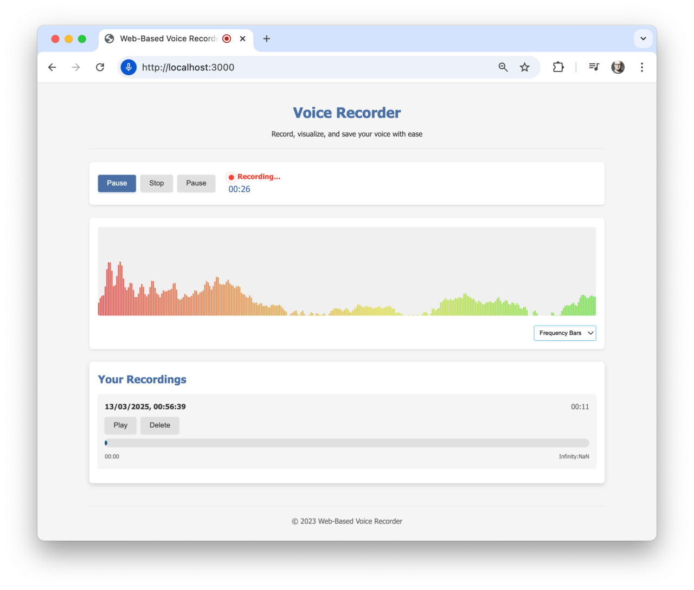

# Web-Based Voice Recorder

A modern, feature-rich voice recording application that runs directly in your web browser. Record, visualize, and save your voice with ease.



## Features

- **Audio Recording**: Record audio through your browser's microphone
- **Playback Controls**: Play, pause, and seek through your recordings
- **Multiple Visualizations**: Choose between waveform, frequency bars, and circular visualizations
- **Local Storage**: Automatically saves recordings to your browser's local storage
- **Responsive Design**: Works on desktop and mobile devices
- **Intuitive UI**: Clean, modern interface with smooth animations and transitions

## Installation

1. Clone the repository:
   ```
   git clone https://github.com/yourusername/web-based-recorder.git
   cd web-based-recorder
   ```

2. Install dependencies:
   ```
   npm install
   ```

3. Start the development server:
   ```
   npm start
   ```

4. Open your browser and navigate to `http://localhost:5000` (or the port shown in your terminal)

## Usage

1. **Grant Microphone Access**: When prompted, allow the application to access your microphone
2. **Record Audio**: Click the "Record" button to start recording
3. **Pause/Resume**: Click the "Pause" button to pause recording, and "Resume" to continue
4. **Stop Recording**: Click the "Stop" button to finish recording
5. **Play Recordings**: Your recordings will appear in the "Your Recordings" section. Click "Play" to listen to them
6. **Change Visualization**: Select a different visualization type from the dropdown menu
7. **Delete Recordings**: Click the "Delete" button next to a recording to remove it

## Technologies Used

- **HTML5** for structure
- **CSS3** for styling and animations
- **JavaScript (ES6+)** for functionality
- **Web Audio API** for audio processing and visualization
- **MediaRecorder API** for recording audio streams
- **Canvas API** for drawing audio visualizations
- **IndexedDB** for storing recordings with localStorage fallback

## Project Structure

```
web-based-recorder/
├── index.html          # Main HTML file
├── src/
│   ├── scripts/        # JavaScript files
│   │   └── main.js     # Core application logic
│   └── styles/         # CSS files
├── img/                # Images and assets
├── docs/               # Documentation
└── node_modules/       # Dependencies
```

## Browser Compatibility

The application has been tested and works on:
- Chrome (recommended)
- Firefox
- Edge

Safari may have limited functionality due to its implementation of the MediaRecorder API.

## Future Enhancements

- Cloud storage integration
- Audio editing features (trimming, effects)
- Voice recognition and transcription
- Social sharing capabilities
- Custom themes

## Contributing

Contributions are welcome! Please feel free to submit a Pull Request.

1. Fork the repository
2. Create your feature branch (`git checkout -b feature/amazing-feature`)
3. Commit your changes (`git commit -m 'Add some amazing feature'`)
4. Push to the branch (`git push origin feature/amazing-feature`)
5. Open a Pull Request

## License

This project is licensed under the MIT License - see the LICENSE file for details.

## Acknowledgments

- Web Audio API documentation and examples
- Open source community for inspiration and resources